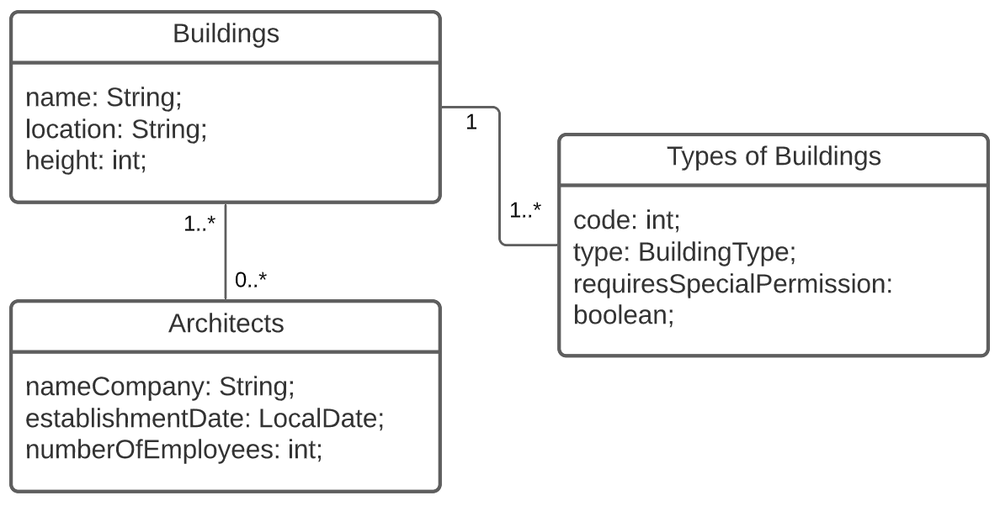

# Project Programming 2.3

This is a progressing project made by **Ruben Brouwers** for **Programming 2.3** in S2 2021-2022.

**Course**: Programming 2.3 <br>
**Name**: Ruben Brouwers <br>
**Email**: ruben.brouwers@student.kdg.be <br>
**ID**: 0146084-02 <br>
**Git Repository**: [prog23/Project](https://gitlab.com/BrouwersRuben/prog23/-/tree/main/Project)
<br>

I continued this project on the project that I made in programming 2.1.

## Domain explanation

Buildings can have multiple architects, architects can also have 0 or more buildings. There is also a many-to-one
relationship between building type and building, a building can only have 1 type, but multiple buildings can have the
same types.



## How to get it Running

- JDK 11
- H2 database
    - No need for PostGreSQL configuration
- [Landing page](http://localhost:6969)

# Weeks
## Week 1
My code will not be able to give a 400, because all exceptions are catched with the @ControllerAdvice and will return a
HTTPStatus 500.

If this exception handler is commented out, it will give a HTTPStatus 400 (Bad Request).
### Get
#### 200 Ok
```http request
GET http://localhost:6969/api/architects HTTP/1.1
Accept: application/json
```
```http request
HTTP/1.1 200 
Content-Type: application/json
Transfer-Encoding: chunked
Date: Tue, 15 Feb 2022 20:47:27 GMT
Keep-Alive: timeout=60
Connection: keep-alive

[
  {
    "id": 1,
    "nameCompany": "Zaha Hadid Architects",
    "establishmentDate": "1980-01-01",
    "numberOfEmployees": ...
```
#### 204 No Content
```http request
GET http://localhost:6969/api/architects/900 HTTP/1.1
Accept: application/json
```
```http request
HTTP/1.1 204 
Date: Tue, 15 Feb 2022 20:48:21 GMT
Keep-Alive: timeout=60
Connection: keep-alive

<Response body is empty>
```
#### 404 Not Found
```http request
GET http://localhost:6969/api/architectss HTTP/1.1
Accept: application/json
```
```http request
HTTP/1.1 404 
Vary: Origin
Vary: Access-Control-Request-Method
Vary: Access-Control-Request-Headers
Content-Type: application/json
Transfer-Encoding: chunked
Date: Tue, 15 Feb 2022 20:48:53 GMT
Keep-Alive: timeout=60
Connection: keep-alive

{
  "timestamp": "2022-02-15T20:48:53.909+00:00",
  "status": 404,
  "error": "Not Found",
  "path": "/api/architectss"
}
```
### Delete
#### 200 Ok
```http request
DELETE http://localhost:6969/api/architects/1 HTTP/1.1
Accept: application/json
```
```http request
HTTP/1.1 200 
Content-Length: 0
Date: Tue, 15 Feb 2022 20:53:43 GMT
Keep-Alive: timeout=60
Connection: keep-alive

<Response body is empty>
```
#### 204 No Content
How is there a code created 204 No content with a delete... When there is not a record to delete, it will throw a 404
```http request

```
```http request

```
#### 500 Internal Server Error
This request returned a 500 because of my general exception handler. There the message was No value present which technically is a 404
```http request
DELETE http://localhost:6969/api/architects/69 HTTP/1.1
Accept: application/json
```
```http request
HTTP/1.1 500 
Content-Type: application/json
Transfer-Encoding: chunked
Date: Tue, 15 Feb 2022 20:59:09 GMT
Connection: close

{
  "timestamp": "2022-02-15T20:59:09.019+00:00",
  "status": 500,
  "error": "Internal Server Error",
  "path": "/api/architects/69"
}
```
## Week 2
### Content Negotiation
#### Retrieving all buildings in JSON format
```http request
GET http://localhost:6969/api/buildings HTTP/1.1
Accept: application/json
```
```http request
HTTP/1.1 200
Content-Type: application/json
Transfer-Encoding: chunked
Date: Tue, 15 Feb 2022 21:22:59 GMT
Keep-Alive: timeout=60
Connection: keep-alive

[
  {
    "id": 1,
    "name": "Port Authority",
    "location": "Antwerp, Belgium",
    "height": 46.0,
    "type": {
      "id": 1,
      "code": "s3n",
      "type": "BUSIN...
```
#### Retrieving all architects in XML format
```http request
GET http://localhost:6969/api/architects HTTP/1.1
Accept: application/xml
```
```http request
HTTP/1.1 200 
Content-Type: application/xml;charset=UTF-8
Transfer-Encoding: chunked
Date: Tue, 15 Feb 2022 21:25:49 GMT
Keep-Alive: timeout=60
Connection: keep-alive

<List>
    <item>
        <id>1</id>
        <nameCompany>Zaha Hadid Architects</nameCompany>
        <establishmentDate>1980-01-01</establishmentDate>
        <numberOfEmployees>6969</numberOfEmployees>
        <buildings>
            <buildings>
                <id>1</id>
                <name>Port Authori...
```
### Post
#### 201 Created
```http request
POST http://localhost:6969/api/buildings HTTP/1.1
Accept: application/json
Content-Type: application/json

{
  "name" : "testing",
  "location" : "Antwerp, BE",
  "height" : 123,
  "architectsIDs" : [1],
  "type" : "SLUMS"
}
```
```http request
HTTP/1.1 201 
Content-Length: 0
Date: Tue, 15 Feb 2022 21:02:43 GMT
Keep-Alive: timeout=60
Connection: keep-alive

<Response body is empty>
```
#### 204 No Content
How is there a 204 no content with a post?
```http request

```
```http request

```
#### 400 Bad Request
```http request
POST http://localhost:6969/api/buildingss HTTP/1.1
Accept: application/json
Content-Type: application/json

{
  "name" : "te",
  "location" : "Antwerp, BE",
  "height" : 123,
  "architectsIDs" : [1],
  "type" : "SLUMS"
}
```
```http request
HTTP/1.1 400
Content-Length: 0
Date: Tue, 15 Feb 2022 21:11:06 GMT
Connection: close

<Response body is empty>
```
#### 404 Not Found
```http request
POST http://localhost:6969/api/buildingss HTTP/1.1
Accept: application/json
Content-Type: application/json

{
  "name" : "testing",
  "location" : "Antwerp, BE",
  "height" : 123,
  "architectsIDs" : [1],
  "type" : "SLUMS"
}
```
```http request
HTTP/1.1 404 
Vary: Origin
Vary: Access-Control-Request-Method
Vary: Access-Control-Request-Headers
Content-Type: application/json
Transfer-Encoding: chunked
Date: Tue, 15 Feb 2022 21:04:04 GMT
Keep-Alive: timeout=60
Connection: keep-alive

{
  "timestamp": "2022-02-15T21:04:04.643+00:00",
  "status": 404,
  "error": "Not Found",
  "path": "/api/buildingss"
}
```
### Put
How is there a code created 201 with a put... this is more like an update
#### 201 Created
```http request

```
```http request

```
#### 204 No Content
```http request
PUT http://localhost:6969/api/architects/1 HTTP/1.1
Content-Type: application/json

{
  "id" : "1",
  "numberOfEmployees" : 6969
}
```
```http request
HTTP/1.1 200 
Content-Length: 0
Date: Tue, 15 Feb 2022 21:04:50 GMT
Keep-Alive: timeout=60
Connection: keep-alive

<Response body is empty>
```
#### 404 Not Found
```http request
PUT http://localhost:6969/api/architectss/1 HTTP/1.1
Content-Type: application/json

{
  "id" : "1",
  "numberOfEmployees" : 6969
}
```
```http request
HTTP/1.1 404 
Vary: Origin
Vary: Access-Control-Request-Method
Vary: Access-Control-Request-Headers
Content-Type: application/json
Transfer-Encoding: chunked
Date: Tue, 15 Feb 2022 21:06:45 GMT
Keep-Alive: timeout=60
Connection: keep-alive

{
  "timestamp": "2022-02-15T21:06:45.465+00:00",
  "status": 404,
  "error": "Not Found",
  "path": "/api/architectss/1"
}
```
#### 409 Conflict
```http request
PUT http://localhost:6969/api/architects/153 HTTP/1.1
Content-Type: application/json

{
  "id" : "1",
  "numberOfEmployees" : 6969
}
```
```http request
HTTP/1.1 409 
Content-Length: 0
Date: Tue, 15 Feb 2022 21:05:57 GMT
Keep-Alive: timeout=60
Connection: keep-alive

<Response body is empty>
```