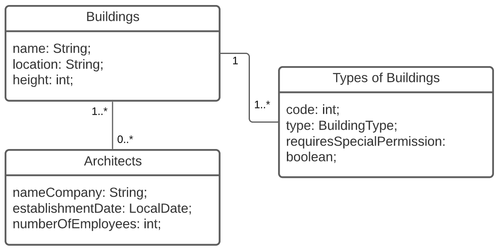
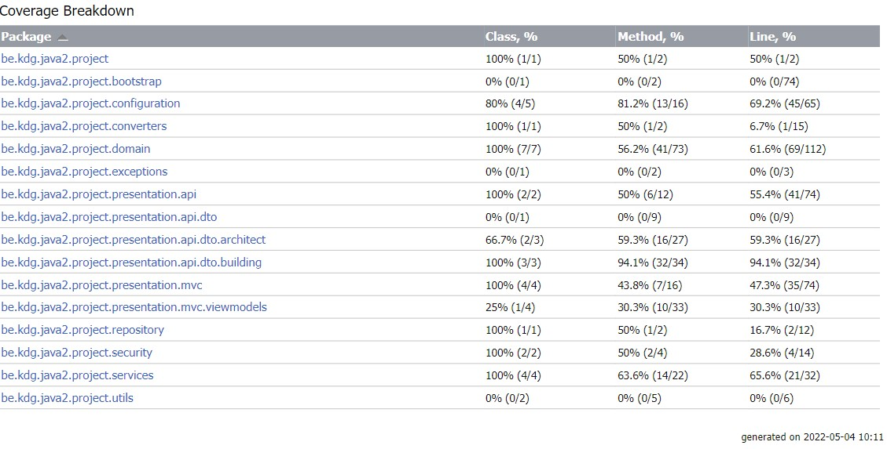

# Project Programming 2.3

This is a progressing project made by **Ruben Brouwers** for **Programming 2.3** in S2 2021-2022.

>**Course**: Programming 2.3 <br>
**Name**: Ruben Brouwers <br>
**Email**: ruben.brouwers@student.kdg.be <br>
**ID**: 0146084-02 <br>
>**Git Repository**: [prog23/Project](https://gitlab.com/BrouwersRuben/prog23/-/tree/main/Project)
<br>

I continued this project on the project that I made in programming 2.1.

---

## How to get it Running

- JDK 11
- H2 database
  - No need for PostGreSQL configuration
- Enter the command ```./gradlew bootRun``` in the terminal within the project directory. (npm should build, and spring boot should start)
  - [Landing page](http://localhost:6969)
- Testing you can do with the command ```./gradlew test```
  - Some of the tests fail when you run it through commandline, but succeed when you run it through intelliJ.

### Profiles
- Test:
  - Only used in the SeedData class, when this profile is selected, that commandline runner should not execute.

---

## Domain explanation

Buildings can have multiple architects, architects can also have 0 or more buildings. There is also a many-to-one
relationship between building type and building, a building can only have 1 type, but multiple buildings can have the
same types.



---

# Weeks
## Week 1
My code will not be able to give a 400, because all exceptions are catched with the @ControllerAdvice and will return a
HTTPStatus 500.

If this exception handler is commented out, it will give a HTTPStatus 400 (Bad Request).
### Get
#### All
##### 200 Ok
```http request
GET http://localhost:6969/api/architects HTTP/1.1
Accept: application/json
```
```http request
HTTP/1.1 200
Content-Type: application/json
Transfer-Encoding: chunked
Date: Mon, 21 Feb 2022 20:48:59 GMT
Keep-Alive: timeout=60
Connection: keep-alive

[
  {
    "id": 1,
    "nameCompany": "Zaha Hadid Architects",
    "establishmentDate": "1980-01-01",
    "numberOfEmployees": 900,
    "buildings": [
      {
        "id": 2,
        "name": "Vitra Fire St...
```
A 204 will appear if there are no records of any architect in the database, very unlikely.

#### 1 Record
##### 200 Ok
```http request
GET http://localhost:6969/api/architects/1 HTTP/1.1
Accept: application/json
```
```http request
HTTP/1.1 200
X-Content-Type-Options: nosniff
X-XSS-Protection: 1; mode=block
Cache-Control: no-cache, no-store, max-age=0, must-revalidate
Pragma: no-cache
Expires: 0
Content-Type: application/json
Transfer-Encoding: chunked
Date: Mon, 21 Mar 2022 08:11:37 GMT
Keep-Alive: timeout=60
Connection: keep-alive

{
  "id": 1,
  "nameCompany": "Zaha Hadid Architects",
  "establishmentDate": "1980-01-01",
  "numberOfEmployees": 708,
  "buildings": [
    {
      "id": 1,
      "name": "Port Autho...
```
##### 204 Not Found
```http request
GET http://localhost:6969/api/architects/420 HTTP/1.1
Accept: application/json
```
```http request
HTTP/1.1 204
X-Content-Type-Options: nosniff
X-XSS-Protection: 1; mode=block
Cache-Control: no-cache, no-store, max-age=0, must-revalidate
Pragma: no-cache
Expires: 0
Date: Mon, 21 Mar 2022 08:12:07 GMT
Keep-Alive: timeout=60
Connection: keep-alive

<Response body is empty>
```
#### All ... of ...
##### 200 Ok
```http request
GET http://localhost:6969/api/buildings?location=Denmark HTTP/1.1
Accept: application/json
```
```http request
HTTP/1.1 200
X-Content-Type-Options: nosniff
X-XSS-Protection: 1; mode=block
Cache-Control: no-cache, no-store, max-age=0, must-revalidate
Pragma: no-cache
Expires: 0
Content-Type: application/json
Transfer-Encoding: chunked
Date: Mon, 21 Mar 2022 08:12:56 GMT
Keep-Alive: timeout=60
Connection: keep-alive

[
  {
    "id": 4,
    "name": "The Uno-X Petrol Station",
    "location": "Denma
```
##### 204 No Content
```http request
GET http://localhost:6969/api/buildings?location=Hoevenen HTTP/1.1
Accept: application/json
```
```http request
HTTP/1.1 204
X-Content-Type-Options: nosniff
X-XSS-Protection: 1; mode=block
Cache-Control: no-cache, no-store, max-age=0, must-revalidate
Pragma: no-cache
Expires: 0
Date: Mon, 21 Mar 2022 08:13:35 GMT
Keep-Alive: timeout=60
Connection: keep-alive

<Response body is empty>
```http request

```
```http request

```
### Delete
#### 200 Ok
```http request
DELETE http://localhost:6969/api/buildings/1 HTTP/1.1
Accept: application/json
```
```http request
HTTP/1.1 200
Date: Mon, 21 Feb 2022 20:54:26 GMT
Keep-Alive: timeout=60
Connection: keep-alive

<Response body is empty>
```
#### 404 Not Found
```http request
DELETE http://localhost:6969/api/buildings/420 HTTP/1.1
Accept: application/json
```
```http request
HTTP/1.1 404
Date: Mon, 21 Feb 2022 20:54:53 GMT
Keep-Alive: timeout=60
Connection: keep-alive

<Response body is empty>
```
## Week 2
### Post
#### 201 Created
```http request
POST http://localhost:6969/api/buildings HTTP/1.1
Accept: application/json
Content-Type: application/json

{
  "name" : "testing",
  "location" : "Antwerp, BE",
  "height" : 123,
  "architectsIDs" : [1],
  "type" : "SLUMS"
}
```
```http request
HTTP/1.1 201
Content-Type: application/json
Transfer-Encoding: chunked
Date: Fri, 04 Mar 2022 12:49:56 GMT
Keep-Alive: timeout=60
Connection: keep-alive

{
  "id": 5,
  "name": "testing",
  "location": "Antwerp, BE",
  "height": 123.0,
  "type": {
    "id": 5,
    "code": "gp
```
### Put
#### 204 No Content
```http request
PUT http://localhost:6969/api/architects/1 HTTP/1.1
Content-Type: application/json

{
  "id" : 1,
  "numberOfEmployees" : 900
}
```
```http request
HTTP/1.1 204
Date: Mon, 21 Feb 2022 20:57:15 GMT
Keep-Alive: timeout=60
Connection: keep-alive

<Response body is empty>
```
#### 404 Not Found
```http request
PUT http://localhost:6969/api/architects/420 HTTP/1.1
Content-Type: application/json

{
  "id" : 420,
  "numberOfEmployees" : 6969
}
```
```http request
HTTP/1.1 404
Date: Mon, 21 Feb 2022 20:57:41 GMT
Keep-Alive: timeout=60
Connection: keep-alive

<Response body is empty>
```
#### 409 Conflict
```http request
PUT http://localhost:6969/api/architects/1 HTTP/1.1
Content-Type: application/json

{
  "id" : 420,
  "numberOfEmployees" : 6969
}
```
```http request
HTTP/1.1 409
Date: Mon, 21 Feb 2022 20:58:10 GMT
Keep-Alive: timeout=60
Connection: keep-alive

<Response body is empty>
```
### Content Negotiation
#### Retrieving all buildings in JSON format
```http request
GET http://localhost:6969/api/buildings HTTP/1.1
Accept: application/json
```
```http request
HTTP/1.1 200
Content-Type: application/json
Transfer-Encoding: chunked
Date: Tue, 15 Feb 2022 21:22:59 GMT
Keep-Alive: timeout=60
Connection: keep-alive

[
  {
    "id": 1,
    "name": "Port Authority",
    "location": "Antwerp, Belgium",
    "height": 46.0,
    "type": {
      "id": 1,
      "code": "s3n",
      "type": "BUSIN...
```
#### Retrieving all architects in XML format
```http request
GET http://localhost:6969/api/architects HTTP/1.1
Accept: application/xml
```
```http request
HTTP/1.1 200
Content-Type: application/xml;charset=UTF-8
Transfer-Encoding: chunked
Date: Tue, 15 Feb 2022 21:25:49 GMT
Keep-Alive: timeout=60
Connection: keep-alive

<List>
    <item>
        <id>1</id>
        <nameCompany>Zaha Hadid Architects</nameCompany>
        <establishmentDate>1980-01-01</establishmentDate>
        <numberOfEmployees>6969</numberOfEmployees>
        <buildings>
            <buildings>
                <id>1</id>
                <name>Port Authori...
```
## Week 3
### Bootstrap Icons
I have added multiple icons, all of which you can find on my *mainpages*.
* [Buildings Page](http://localhost:6969/buildings)
  * A map icon next to the filtering on location input field.
  * [building.html](src/main/resources/templates/mainpages/buildings.html)
* [Architects Page](http://localhost:6969/architects)
  * A people icon next to the filtering on number of employees input field.
  * A buildings icon next to the filtering on company name input field.
  * [architect.html](src/main/resources/templates/mainpages/architects.html)

### Javascript dependecies
I have chosen to add flatpickr and validator to my project.

#### [Flatpickr](https://www.npmjs.com/package/flatpickr)
To see this, you need to add a new architect, and press on the establishmentDate input field. Then you will see the flatpickr date picker.
- [Adding an architect](http://localhost:6969/architects/add)
- Source Files:
  - [addArchitects.html](src/main/resources/templates/addpages/addarchitects.html)
  - [flatpickr.js](src/main/js/flatpickr.js)
  - [site.js](src/main/js/site.js)

#### [Validator](https://www.npmjs.com/package/validator)
To see validator in action you will need to enter:
- a string with more than 30 characters when filtering architects on name.
- write a string with not only numbers when filtering architects on number of employees.
- [Architect mainpage](http://localhost:6969/architects)
- Source files:
  - [architects.html](src/main/resources/templates/mainpages/architects.html) (Not really any validator specific code here, except the script tag which links to the JS file)
  - [filteringArchitects.js](src/main/js/filteringArchitects.js) (here on line 16 & 76 you will find validator code)

## Week 4-5
Unauthenticated user only have access to the landing and login page (soon also the registering page).
Every other pages requires authentication.

### Users
```ROLE_CREATOR > ROLE_UPDATER  > ROLE_USER``` <br>
All what the user can do, the updater can also do, and so on...
#### Creator
> **Username**: Creator <br>
**E-mail**: creator@kdg.be <br>
**Password**: creator <br>

The "creator" can do everything.

#### Updater
> **Username**: Updater <br>
**E-mail**: updater@kdg.be <br>
**Password**: updater <br>

The "updater" can update entities (PUT architect)

* They **cannot** see any off the pages to add entities, including the navbar links to those pages.
  * Any page, because all pages have the navbar.
* They **cannot** delete any entities, (not being able to see the delete buttons.)
  * [Architect detail pages](http://localhost:6969/architects/architectdetail?architectID=1)
  * [Building detail pages](http://localhost:6969/buildings/buildingdetail?buildingID=1)

#### User
>**Username**: User <br>
**E-mail**: user@kdg.be <br>
**Password**: user <br>
>
The "user" can view entities and filter on them

* They **cannot** see any off the pages to add entities, including the navbar links to those pages.
  * Any page, because all pages have the navbar.
* They **cannot** delete any entities, (not being able to see the delete buttons.)
  * [Architect detail pages](http://localhost:6969/architects/architectdetail?architectID=1)
  * [Building detail pages](http://localhost:6969/buildings/buildingdetail?buildingID=1)
* They **cannot** modify any entities, (not being able to see the forms and the buttons.)
  * [Architect detail pages](http://localhost:6969/architects/architectdetail?architectID=1)
* They **cannot** see the login button on the landing page ones logged in.
  * [Landing page](http://localhost:6969/)

### Relations between users and entity
An architect (architect firm) can have employees and a user (normal user, updater, creator) has an architect firm they "work for".
Every logged in user can see these relations under the detail page of each architect, these relations can only be made upon registration, there is no way to modify it, yet...

## Week 6-8
### Coverage Report



### Command-line Instruction
I set my spring profile in each class separately, with the annotation: 
```java
@ActiveProfile("test")
```

The commands to run all tests are: 
```bash
./gradlew test
```
```bash
./gradlew check
```

### Explanation about the tests
#### Mocking tests
I used mocking in all my presentation layer tests, because I mock the user to pass the tests with security enabled.

But the classes where I really focussed the tests on mocking are: 
- [ArchitectControllerMockingTests](src/test/java/be/kdg/java2/project/presentation/api/ArchitectControllerMockingTests.java)
- [BuildingServiceMockingTests](src/test/java/be/kdg/java2/project/services/BuildingServiceMockingTests.java)

#### Verify tests
- [BuildingControllerTests](src/test/java/be/kdg/java2/project/presentation/api/BuildingsControllerTests.java): Line 123
- [ArchitectControllerMockingTests](src/test/java/be/kdg/java2/project/presentation/api/ArchitectControllerMockingTests.java): Line 79

#### Role verification tests
As mentioned before, in all my presentation layer tests I used the role verification (as all my REST calls require authentication). 
But there are 2 tests dedicated to specifically that.

- [ArchitectControllerMockingTests](src/test/java/be/kdg/java2/project/presentation/api/ArchitectControllerMockingTests.java): Line 114
- [BuildingControllerTests](src/test/java/be/kdg/java2/project/presentation/api/BuildingsControllerTests.java): Line 127